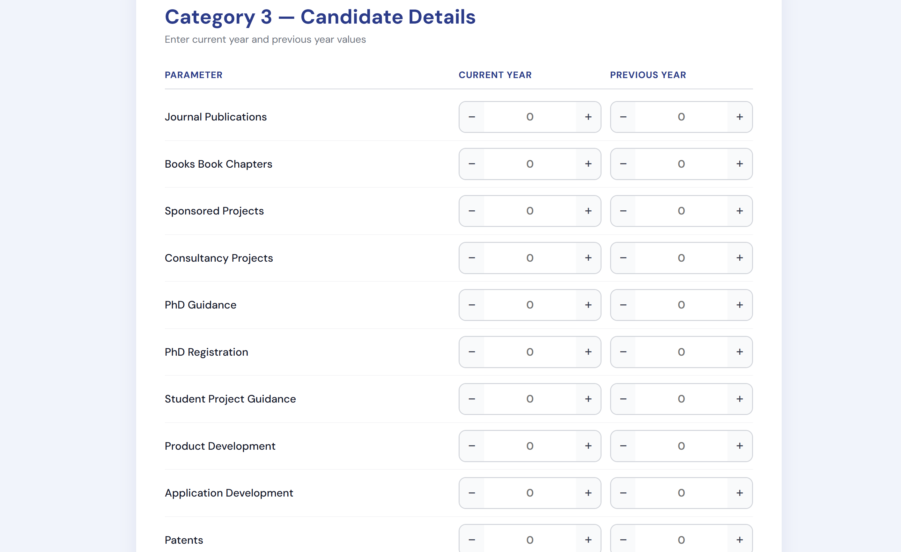
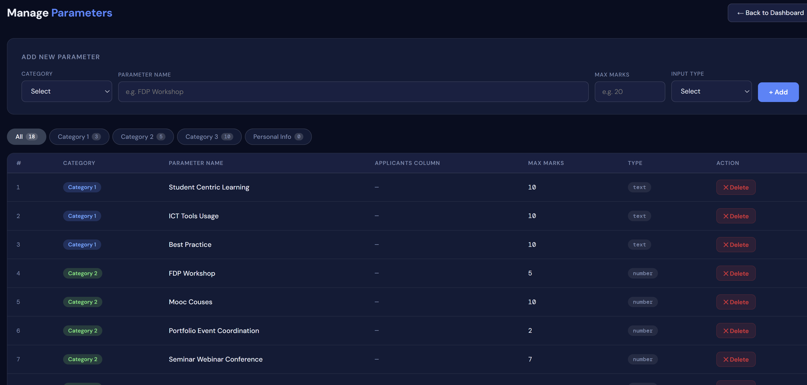
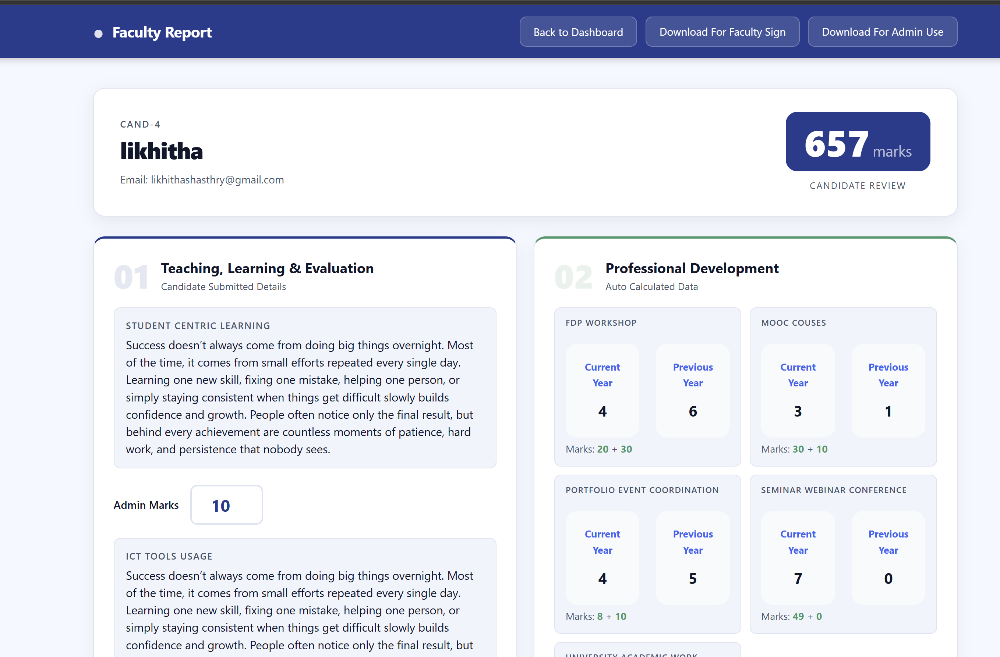

# 🎓 Faculty Recruitment Management System


---

## 📌 Features

### 👨‍🏫 Applicant Module
- Faculty registration and login
- Personal information submission
- Academic qualification details
- Category-wise application form
- Upload supporting documents
- Save and update application

### 👨‍💼 Admin Module
- Secure admin login
- View all applicants
- Verify submitted information
- Assign marks for Category 1 parameters
- Automatic score calculation for Categories 2 & 3
- Generate printable Admin Evaluation Reports
- Generate Faculty Signature Reports
- Print-ready A4 formatted reports

### 📊 Evaluation System
- Teaching, Learning & Evaluation
- Professional Development
- Research & Publications
- Current Year and Previous Year comparison
- Automatic total score calculation

---

## 🛠 Tech Stack

### Frontend
- HTML5
- CSS3
- JavaScript

### Backend
- PHP

### Database
- MySQL

### Server
- Apache (XAMPP)

---

## 📷 Screenshots

### Home Page


### Faculty Application Form


### Admin Parameter Dashboard


### Admin Evaluation Report



> Replace the above images with screenshots from your project.

---

## ⚙ Installation

### 1. Clone the repository

```bash
git clone https://github.com/your-username/faculty-recruitment-system.git
```

### 2. Move the project

Copy the project folder into:

```
xampp/htdocs/
```

### 3. Create the database

Create a MySQL database named:

```
faculty_recruitment
```

### 4. Import the SQL file

Import

```
faculty_recruitment.sql
```

using phpMyAdmin.

### 5. Configure database connection

Edit

```
db.php
```

Update:

```php
$host = "localhost";
$user = "root";
$password = "";
$database = "faculty_recruitment";
```

### 6. Start Apache & MySQL

Open XAMPP and start:

- Apache
- MySQL

### 7. Run the application

Visit

```
http://localhost/faculty-recruitment-system
```

---


## 📋 Evaluation Categories

### Category 1
- Teaching, Learning & Evaluation

### Category 2
- Professional Development

### Category 3
- Research & Publications

The system automatically computes category-wise scores and generates consolidated reports.

---

## 📄 Reports Generated

- Faculty Application Report
- Faculty Signature Report
- Admin Evaluation Report
- Printable PDF-friendly Reports

---

## 🔒 Security Features

- Prepared SQL Statements
- HTML Escaping (`htmlspecialchars`)
- Session-based Authentication
- Input Validation
- Error Handling

---

## 🚀 Future Improvements

- Email Notifications
- PDF Download Option
- Digital Signature Support
- Applicant Status Tracking
- Role-based Access Control
- Search and Filter Applicants
- Export Reports to Excel
- Dashboard Analytics
- Mobile Responsive UI

---

## 👥 Contributors

| Avatar | Contributor | Role |
|:------:|-------------|------|
|  | **[Likhitha Shasthry B. S.](https://github.com/likhitha-shasthry)** | 🗄️ Database design, 🔗 backend integration, 📊 report generation, 🚀 deployment, and overall system integration. |
|  | **[Bindu Yajman](https://github.com/BinduYajman)** | 🎨 Designed and implemented the user interface for the **Application Module**. |
|  | **[Spoorthi U](https://github.com/spoorthiumesh-cmyk)** | 🖥️ Designed and implemented the user interface for the **Admin Module**. |
|  | **[Sanika P](https://github.com/sanikapapanna-cmd)** | 📧 Email integration, SMTP configuration, and notification services. |
|  | **[Sinchana](https://github.com/sinchanamj)** | ✅ Email integration, testing, and email workflow implementation. |

---
---

## 👩‍💻 Author

**Likhitha Shasthry**

GitHub: https://github.com/likhitha-shasthry

---

## 📜 License

This project is developed for educational and institutional purposes.
